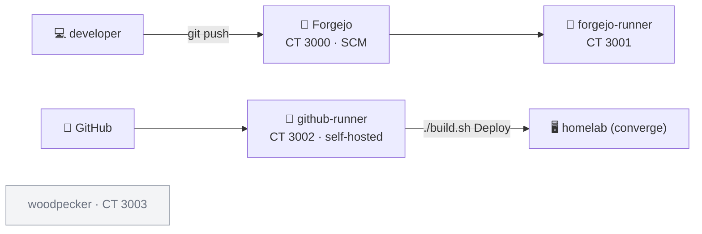

# Homelab.Stacks.DevOps

[](https://github.com/Fallout-build/Fallout)
[](https://github.com/Chrison-Homelab/Homelab)

Self-hosted source control + CI/CD, deployed as **community-scripts LXCs** (one
container per service) and defined as IaC shapes. This is also where the homelab's
own **self-hosted GitHub Actions runner** lives (CT 3002) and where the planned
[internal NuGet feed (BaGet)](https://github.com/Chrison-Homelab/Homelab/issues/292)
will run.

> A [`Homelab.Stacks.*`](https://github.com/Chrison-Homelab/Homelab) submodule,
> mounted at `stacks/DevOps`. Plan: [BL-015](https://github.com/Chrison-Homelab/Homelab/issues/51).



## Members

CTID block **3000–3999** (declared in [`stack.yaml`](stack.yaml); members inherit its `defaults`).

| CTID | Member | Script | Channel | Status |
|------|--------|--------|---------|--------|
| 3000 | [forgejo](forgejo.lxc.yaml) | `ct/forgejo.sh` | stable | ready to deploy |
| 3001 | [forgejo-runner](forgejo-runner.lxc.yaml) | `ct/forgejo-runner.sh` | **dev** (ProxmoxVED) | ready — in-dev script |
| 3002 | [github-runner](github-runner.lxc.yaml) | `ct/github-runner.sh` | stable | ready (new, independent of CT 2005) |
| 3003 | woodpecker | — | — | **parked** — no community-script in either repo yet |

## Deploying

These are LXC shapes for the `homelab/v1` contract, converged by the Fallout
engine from the parent [Homelab](https://github.com/Chrison-Homelab/Homelab) repo:

```bash
# from the Homelab checkout — source secrets once, then:
set -a && . ./secrets.env && set +a
./build.sh Preview --stack DevOps    # dry-run (read-only)
./build.sh Deploy  --stack DevOps    # apply — creates/updates the LXC members over SSH
```

Order: **forgejo (3000)** first, then **github-runner (3002)**, then
**forgejo-runner (3001)** (it registers against Forgejo).

Notes:
- Schema: [`Infrastructure/schema/shape.schema.json`](https://github.com/Chrison-Homelab/Homelab/blob/main/Infrastructure/schema/shape.schema.json); the engine (`Infrastructure/engine`) is the converger.
- CT 3002's github-runner is the homelab's org runner (re-registered to `Chrison-Homelab`); the old CT 2005 is a separate, unmanaged per-repo runner.
- **Woodpecker** is reserved at 3003; a shape will be authored once a community script exists.
- Registration tokens / admin setup / TLS are **post-create** (manual for now) — see the plan's deferred tasks.
- NFS data hardening: [BL-016](https://github.com/Chrison-Homelab/Homelab/issues/52).

## Parking lot

Other DevOps-related bits (runner configs, CI templates, shared workflows, docs)
can live here too as the stack grows.
